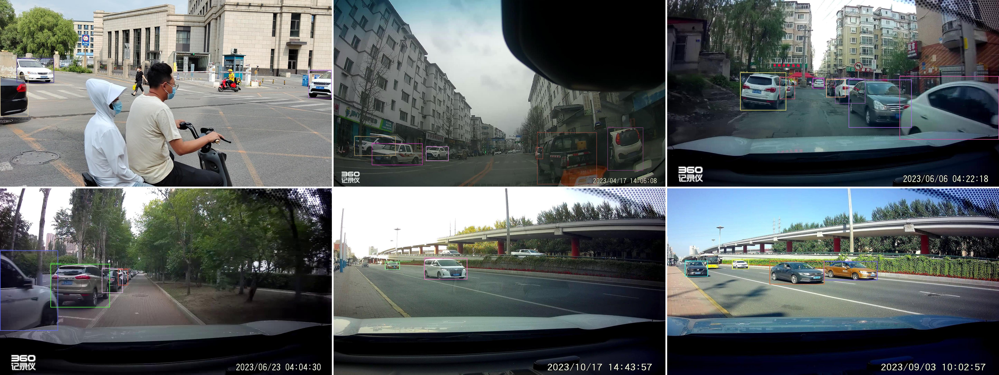

# Fine-Grained Open-Vocabulary Object Detection with Fine-Grained Prompts: Task, Dataset and Benchmark  
Official codebase and dataset for the ICRA 2025 paper (Oral) 
**"Fine-Grained Open-Vocabulary Object Detection with Fine-Grained Prompts: Task, Dataset and Benchmark"**
[[Paper]](https://arxiv.org/abs/2503.14862) | [[Project Page]](https://github.com/tengerye/3FOVD)

---

## Overview

**3F-OVD** introduces a new benchmark for **fine-grained open-vocabulary object detection** (OVD), designed to evaluate detectors under **realistic**, **challenging**, and **scalable** conditions. We highlight the limitations of existing evaluation protocols and propose:

- A novel **evaluation task** that extends fine-grained detection to an open-vocabulary setting with class-level captions.
- A large-scale **NEU-171K dataset** spanning **two domains**: vehicles and retail products.
- A simple yet effective **post-processing method** that boosts the performance of open-vocabulary detectors by reducing false positives.

---

## Dataset: NEU-171K

The NEU-171K dataset includes:
- **145,825 images**, **676,471 bounding boxes**, **719 fine-grained classes**.
- Two domains: NEU-171K-C and NEU-171K-RP.

### NEU-171K-C
NEU-171K-C contains cars in real-world traffic scenes.


### NEU-171K-RP
NEU-171K-RP contains retail products captured in controlled warehouse settings.


You can access the dataset from:

- [Kaggle](./datasets/README.md#kaggle)
- [HuggingFace](https://huggingface.co/datasets/tengerye/NEU-171K)
- [Dropbox](./datasets/README.md#dropbox)
- [Baidu Netdisk](./datasets/README.md#baidu-netdisk)

More details on dataset structure and statistics are in [`datasets/README.md`](./datasets/README.md).

---

## Benchmarking & Codebase

This repository includes:
```
- datasets/
    - README.md          # Dataset description and download instructions

- src/
    - supervised/        # Training & evaluation of traditional detectors (Section V-B)
    - open_vocabulary/   # Evaluation of open-vocabulary detectors (Section V-C)
        - cora/
        - detic/
        - gdino/
        - vild/

    - post_process/      # Our custom post-processing for reducing false positives (Section V-D)
```

### Supported Baselines
- **Supervised**: Co-DETR, Faster R-CNN, FCOS, PAA, etc.
- **Open-Vocabulary**: ViLD, Detic, Grounding DINO

### Run Evaluation
Instructions for running each baseline and applying the post-processing trick are included in the respective subfolders under `src/`.

---

## Benchmarks

| Method | Trick | NEU-171K-C         | NEU-171K-RP         |
|--------|-------|--------------------|---------------------|
| GDino  | w/o   | 1.2e-03            | 7.4e-04             |
| GDino  | w     | 1.3e-03 (+8.3%)    | 7.6e-04 (+2.6%)     |
| Detic  | w/o   | 6.3e-04            | 2.0e-02             |
| Detic  | w     | 6.6e-04 (+4.7%)    | 2.2e-02 (+10.0%)    |
| Vild   | w/o   | 3.3e-04            | 7.5e-03             |
| Vild   | w     | 3.8e-04 (+15.2%)   | 10.6e-03 (+41.3%)   |


Post-processing improves accuracy by reducing false-positive bounding boxes generated from caption tokens.

---

## Citation

If you use this work, please cite:
```bibtex
@article{liu2025fine,
  title={Fine-Grained Open-Vocabulary Object Detection with Fine-Grained Prompts: Task, Dataset and Benchmark},
  author={Liu, Ying and Hua, Yijing and Chai, Haojiang and Wang, Yanbo and Ye, TengQi},
  journal={arXiv preprint arXiv:2503.14862},
  year={2025}
}
```
